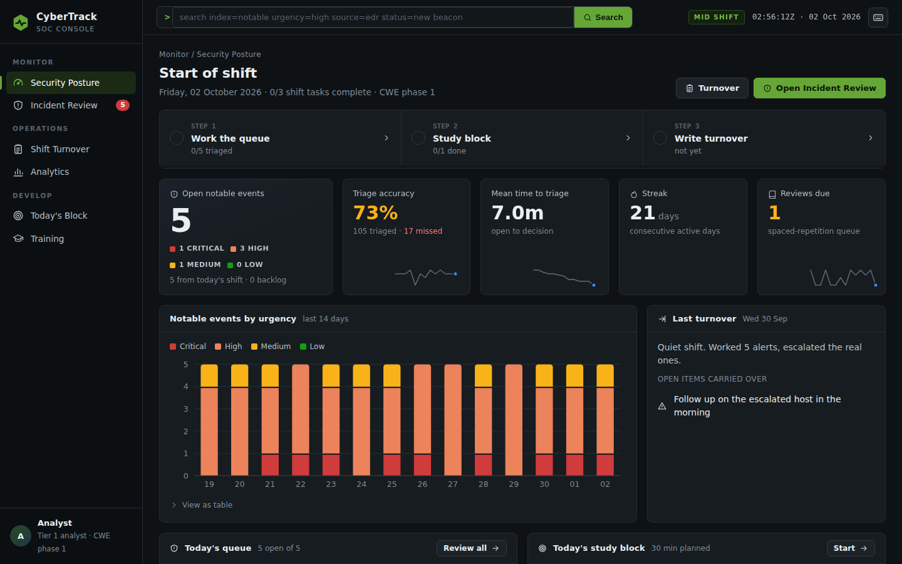
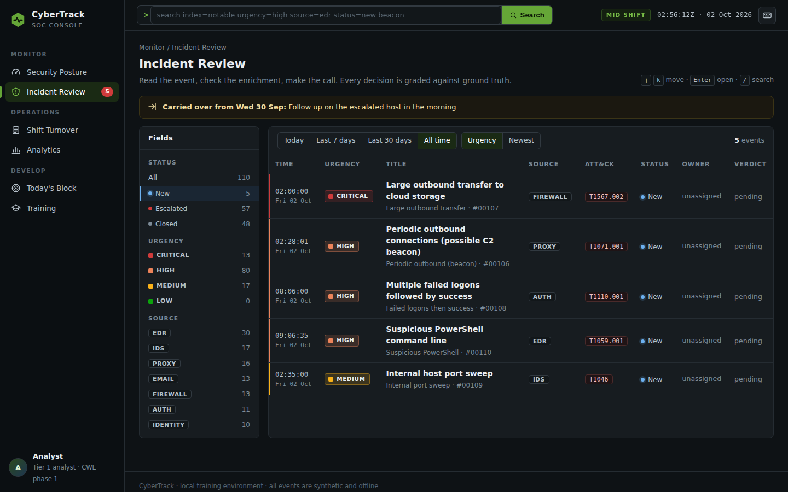
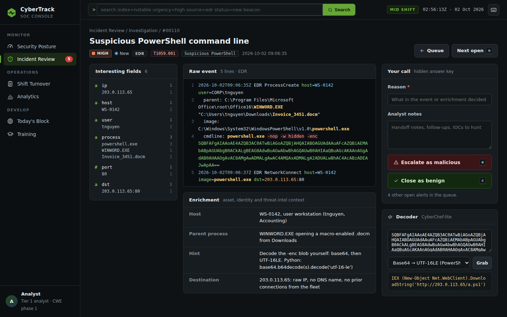
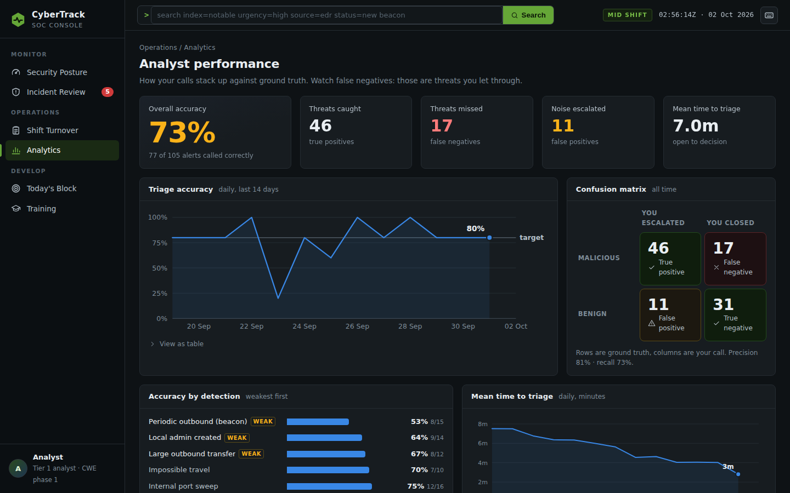
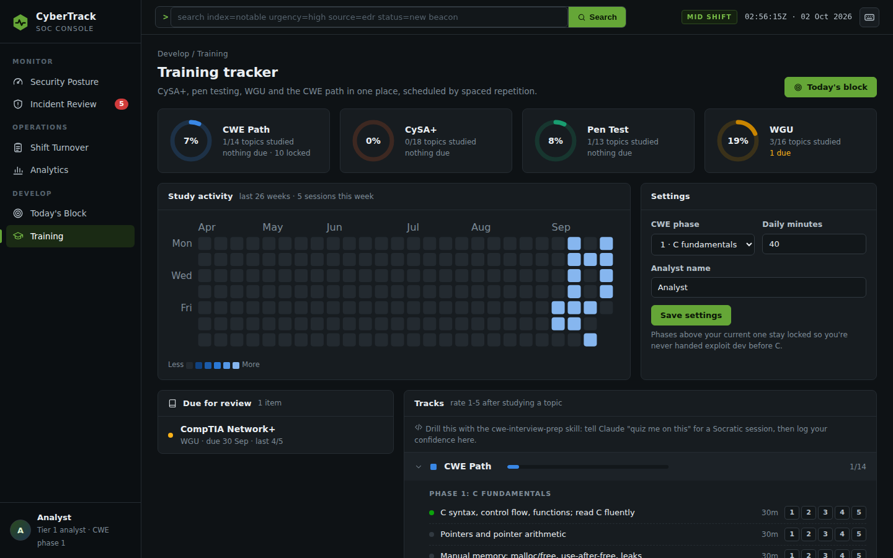

# CyberTrack

A local, single-user cybersecurity practice portal. You log in each day and work it
like a real cybersecurity job: pull up alerts, triage them, write shift turnover, and
keep a long-running study plan moving across CySA+, pen testing, your WGU coursework,
and the Cyber Warfare Engineer path.

Everything is synthetic and runs offline. No real networks, no live threat feeds, no
third-party accounts. The alerts are generated on your machine and graded against a
built-in answer key so you get immediate feedback on every call.



## The console

CyberTrack is styled after a Splunk Enterprise Security SOC console, so the daily reps
build familiarity with how real analyst tooling looks and moves.

- **Security Posture** is where a shift starts. It shows a three-step shift checklist
  (queue, study, turnover), open notables split by urgency, triage accuracy, mean time to
  triage, your streak, a 14-day "notable events by urgency" timeline, last shift's
  turnover, and the MITRE ATT&CK techniques seen this week.
- **Incident Review** is the alert queue. It has a field sidebar with counts, time-range
  and sort controls, urgency-striped rows, ATT&CK IDs, owner, and your verdict per alert.
- **Investigation** opens one alert in three columns. The left column lists interesting
  fields extracted from the log, and clicking a value pivots a search across every event.
  The center shows the syntax-highlighted raw event and its enrichment. The right side
  holds the triage panel and a built-in **Decoder** (Base64, UTF-16LE for PowerShell
  `-enc`, URL, hex) that can grab the encoded blob straight from the event.
- **Every decision is graded** against a hidden answer key. You see what gave it away, the
  analysis, a response playbook, and prior cases from the same detection to compare.
- **Cases**: escalating an alert opens an incident case automatically. Each case walks the
  NIST SP 800-61 lifecycle (detection, containment, eradication, recovery, lessons learned)
  with a stepper, a response-task checklist seeded from the detection's playbook, and a
  notes timeline stamped with the current stage. To close a case, move it to Lessons
  learned and submit a six-section incident report: executive summary, timeline, scope
  and impact, IOCs, root cause, and recommendations. A transparent rubric grades the
  report 0-100. It checks that each section is complete, that the timeline has
  time-stamped entries, how many of the event's indicators you cite (defanged forms
  count), and whether your recommendations cover the playbook. You can resubmit as often
  as you like. Escalating benign activity opens a false-positive case instead, which you
  close with a short note.
- **Shift Turnover** auto-fills shift stats: worked, accuracy, missed threats, MTTT and
  backlog. Your open items carry into the next day's queue.
- **Analytics** charts accuracy over time against an 80% target. It also shows a confusion
  matrix with precision and recall, accuracy per detection with weak spots flagged,
  MTTT trend, and events by source.
- **Training** covers four tracks (CySA+, Pen Test, WGU, CWE path) with progress rings, a
  26-week study heatmap, a spaced-repetition review queue, and CWE phase gating.

There are eight detections, and each has a malicious variant and a benign look-alike that
fires the same rule. Triage is a real decision, not pattern-matching the title. The rules
are brute force, C2 beaconing, encoded PowerShell, internal port sweeps, phishing clicks,
impossible travel, data exfiltration, and rogue admin accounts.

| Incident Review | Investigation |
|---|---|
|  |  |
| **Analytics** | **Training** |
|  |  |

### Search

The top bar takes SPL-flavored searches over every notable event:

```
index=notable urgency=high source=edr status=new
technique=T1059* "rundll32" earliest=-7d
source!=proxy verdict=wrong
```

- Supported fields are `urgency`, `source`, `status`, `technique`, `rule`, and `verdict`.
  Each takes `=` or `!=`, and values accept `*` wildcards.
- `earliest=-Nd` limits results to the last N days.
- Anything else is free text, matched against the title, raw log, and enrichment.
- `index=` and `sourcetype=` are accepted and ignored, so muscle memory works.
- The answer key is never searchable.

### Keyboard

| Key | Action |
|---|---|
| `/` | Focus search |
| `g` then `p` `r` `c` `t` `a` `s` | Go to posture, review, cases, turnover, analytics, or training |
| `j` / `k`, `Enter` | Move through the queue, open an alert |
| `e` / `c` | Escalate or close the open alert (prompts for a reason first) |
| `n` | Next open alert |
| `?` | Show all shortcuts |

## Quick start

```bash
python3 -m venv .venv
source .venv/bin/activate
pip install -r requirements.txt

# Option A: start empty (curriculum auto-loads on first run)
python run.py

# Option B: fill it with three weeks of sample activity first, so the charts have history
flask --app cybertrack demo --days 21
python run.py
```

Then open http://127.0.0.1:5000.

A typical day takes about 30-45 minutes. Open **Security Posture**, work **Incident
Review** at a few minutes per alert, do **Today's Block**, then write **Shift Turnover**.

## Commands

```bash
flask --app cybertrack seed        # load the curriculum (idempotent)
flask --app cybertrack demo --days 21  # fabricate past shifts + study for a populated UI
flask --app cybertrack reset       # wipe activity and cases, keep the curriculum
pytest                             # run the test suite
```

## Set it up for yourself

- **CWE phase, daily minutes and your analyst name** are set on the **Training** page. Only CWE topics at or
  below your current phase get scheduled, so you're not handed exploit-dev before C.
- **Curriculum** lives in `data/curriculum/*.yaml`. Edit freely. In particular,
  `wgu.yaml` is seeded with the standard course list; mark courses you've passed with
  `active: false` (or delete them) so only remaining work gets scheduled.
- **Shift size** (alerts per day, minutes per alert) is stored in settings with sensible
  defaults in `cybertrack/db.py` (`DEFAULTS`).

## How it fits with the CWE interview-prep skill

Your existing `cwe-interview-prep` skill runs the actual Socratic quizzing (trace it,
break it, write it, explain it) and keeps its own roadmap and miss log. CyberTrack does
**not** duplicate that. It schedules the CWE topics beside everything else and tracks your
progress; when a CWE topic comes up, tell Claude "quiz me on this" to run a session with
the skill, then log your confidence back in CyberTrack. The two stay loosely coupled:
there's no automatic two-way sync in this build.

## Project layout

```
cybertrack/
  __init__.py        app factory, config
  models.py          SQLAlchemy models
  db.py              engine, sessions, the app clock, settings, additive migration
  analytics.py       aggregations behind every chart and KPI
  viz.py             chart geometry for server-rendered SVG (no JS chart library)
  planner.py         builds each day's plan (alerts + study)
  cli.py             seed / demo / reset commands
  soc/
    scenarios.py     the eight detections, each malicious + benign
    generator.py     builds a shift, grades triage, computes metrics
    search.py        SPL-flavored search parser
    fields.py        field extraction + XSS-safe log highlighting
    routes.py        queue, alert detail, turnover, metrics
  study/
    curriculum.py    loads the YAML tracks
    scheduler.py     SM-2-lite spaced repetition + daily selection
    routes.py        tracker, today's tasks, settings
  dashboard/routes.py  Security Posture
  templates/         Jinja pages + macros.html (badges, KPI tiles, charts)
  static/            app.css (design system) + app.js (shortcuts, tooltips, decoder)
data/curriculum/     cysa.yaml, pentest.yaml, wgu.yaml, cwe.yaml
tests/               generator, scheduler, search, fields, viz, end-to-end app tests
docs/screenshots/    UI screenshots
```

## Replaying a specific day

Set `CYBERTRACK_TODAY=YYYY-MM-DD` to make the app treat that as today. Useful for testing
the turnover carry-over or generating a particular day's shift.

## Roadmap (next, not in this build)

Self-contained Docker labs under `labs/`: a vulnerable-by-design web app for the pen-test
track, reverse-engineering and binary challenge targets that ladder with the CWE phases,
and a log-replay lab that feeds a real attack capture into the SOC queue. CyberTrack will
get a `/labs` launcher that starts a container, tracks completion, and links the lab to its
curriculum item. All targets are locally built and locally attacked.

## Note

CyberTrack is a personal training tool. The scenarios teach you to recognize and respond
to attacker behavior from the defender's seat. Use the skills you build here only on
systems you're authorized to test.
